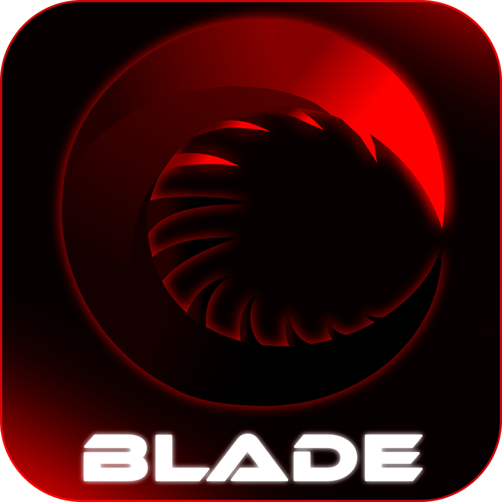

  

<h1 align="center">BLADE</h1>

  <b>Быстрый. Приватный. Тёмное фэнтези.</b> 
  A fast, private, dark-fantasy custom Firefox build for Windows.

  <a href="#-blade"><b>Русский</b></a> · <a href="#-english"><b>English</b></a>

  
  
  
  

---

## ⚔ Blade

**Blade** — персональная сборка Firefox, пересобранная под три вещи: **скорость**, **приватность** и **тёмную эстетику**. Не форк и не расширение — полноценный браузер: пересобранный движок, собственный движок тем и автообновление через этот репозиторий.

### ⚡ Быстрый
- 4 контентных процесса вместо восьми — вдвое меньше RAM в простое
- Кэш целиком в памяти (256 МБ) — страницы и обложки не дёргают диск
- HTTP/3 (QUIC) с 0-RTT, спекулятивный пре-коннект по наведению на ссылку
- Прогрев вкладок: переключение выглядит мгновенным
- Видео декодирует GPU; полностью перекрытое окно не рендерит вообще
- Все интерфейсные анимации — только на `transform`/`opacity`: красота без цены в кадрах

### 🕶 Приватный
- Телеметрия, health-report, эксперименты и crash-reporter выключены на уровне ядра и политик
- Шифрованный DNS (DoH) + ECH — провайдер не видит, какие сайты вы открываете
- ETP Strict, uBlock Origin с зафиксированными списками (включая анти-детект адблока)

### 🌑 Красивый
- **10 встроенных тёмных тем** — от GX Red до Midnight Blue — и конструктор своей
- Живое переключение темы **на всех поверхностях**: тулбар, новая вкладка, обложки плиток, даже скроллбары чужих сайтов
- Тематические обложки для 16+ популярных сайтов — у каждой темы свои
- Часы с погодой на новой вкладке, фирменные микроработы: «обнажение клинка» при фокусе адресной строки, «корона» активной вкладки

### 🔄 Сам обновляется
- Раз в сутки проверяет этот репозиторий; обновление — в один клик, с бэкапом и автоматическим откатом
- «Хроника обновлений» — панель с заметками релиза после каждого обновления
- Самовосстановление: протухший токен доступа отбрасывается автоматически

### 🗡 Кодовые имена
У каждого релиза — тёмно-фэнтезийное имя:

| Версия | Имя |
|---|---|
| 1.7.0 | **Пепельный Венец** (Ashen Crown) |
| 1.6.3 | Полуночный Клинок (Midnight Blade) |

### Установка и обновления
- **Обновления** — автоматически из [Releases](https://github.com/deni41144/blade-browser/releases) (или меню **B → ОБНОВЫ → Проверить сейчас**)
- **Установщик** Blade-Setup — у автора сборки

---

## ⚔ English

**Blade** is a personal Firefox build re-forged around three things: **speed**, **privacy** and a **dark-fantasy aesthetic**. Not a fork, not an extension — a full browser: a rebuilt engine, a custom theming engine and self-updates served from this repository.

### ⚡ Fast
- 4 content processes instead of eight — half the RAM at idle
- Memory-only cache (256 MB) — pages and covers never touch the disk
- HTTP/3 (QUIC) with 0-RTT, speculative preconnect on link hover
- Tab warmup: switching feels instant
- GPU video decoding; fully occluded windows stop rendering entirely
- All UI animations run on `transform`/`opacity` only — beauty with zero per-frame cost

### 🕶 Private
- Telemetry, health reports, experiments and the crash reporter disabled at the core and policy level
- Encrypted DNS (DoH) + ECH — your ISP can't see which sites you visit
- ETP Strict, uBlock Origin with admin-locked filter lists (including anti-detection lists)

### 🌑 Beautiful
- **10 built-in dark themes** — from GX Red to Midnight Blue — plus a custom theme constructor
- Live theme switching **everywhere**: toolbar, new tab, tile covers, even scrollbars on foreign sites
- Themed tile covers for 16+ popular sites, one set per theme
- Clock & weather on the new tab; signature micro-motions: the "blade unsheathing" on address-bar focus, the "crown" on the active tab

### 🔄 Self-updating
- Checks this repository daily; one-click install with backup and automatic rollback
- "Chronicle of Updates" panel shows release notes after every update
- Self-healing: a stale access token is discarded automatically

### 🗡 Codenames
Every release carries a dark-fantasy name — the current one is **Ashen Crown** (Пепельный Венец).

### Install & updates
- **Updates** — automatic from [Releases](https://github.com/deni41144/blade-browser/releases) (or menu **B → ОБНОВЫ → Check now**)
- **Installer** — Blade-Setup, available from the build author

---

## Credits & License

- Browser, theming engine, design — **Denis Bobliksov** (Bobliks-Creations)
- Widget & cover artwork — **zxvolfik**, used with permission
- Engine: Mozilla Firefox under **MPL 2.0** — see [LICENSE.md](LICENSE.md)

*Blade is an independent personal build based on Mozilla Firefox. Not affiliated with or endorsed by Mozilla. Firefox is a trademark of the Mozilla Foundation.*

No foxes were harmed in the making of this browser.

